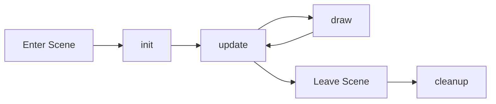

# Framework Package

The Framework package provides high-level APIs for building games with scenes and routing.

## Overview

The framework simplifies game development by providing:

- **Scene Management** - Organize game states (menu, gameplay, game over)
- **Routing** - Navigate between scenes
- **Lifecycle Hooks** - Initialize, update, and cleanup scenes

## Scene API

Define game scenes with lifecycle methods:

```lootiscript
scene("menu", {
  init: function() {
    // Setup menu
  },
  update: function() {
    // Update menu logic
  },
  draw: function() {
    // Render menu
  },
  cleanup: function() {
    // Cleanup when leaving scene
  }
})
```

## Route API

Navigate between scenes:

```lootiscript
// Go to a scene
route.goto("gameplay")

// Get current scene
let current = route.current()

// Check if in a scene
if (route.current() === "menu") {
  // In menu
}
```

## Scene Lifecycle

1. **Init** - Called once when scene is entered
2. **Update** - Called every frame
3. **Draw** - Called every frame after update
4. **Cleanup** - Called when leaving scene



## Example: Multi-Scene Game

```lootiscript
// Menu scene
scene("menu", {
  init: function() {
    console.log("Menu loaded")
  },
  update: function() {
    if (input.isKeyPressed("Space")) {
      route.goto("game")
    }
  },
  draw: function() {
    canvas.clear("black")
    canvas.drawText("Press SPACE to start", 300, 300, "24px Arial", "white")
  }
})

// Game scene
scene("game", {
  init: function() {
    // Reset game state
    score = 0
    playerX = 400
    playerY = 300
  },
  update: function() {
    // Game logic
    updatePlayer()
    updateEnemies()
    
    if (gameOver) {
      route.goto("gameover")
    }
  },
  draw: function() {
    canvas.clear("black")
    drawPlayer()
    drawEnemies()
    drawUI()
  }
})

// Game Over scene
scene("gameover", {
  init: function() {
    // Save high score
    if (score > storage.get("highScore", 0)) {
      storage.set("highScore", score)
    }
  },
  update: function() {
    if (input.isKeyPressed("Space")) {
      route.goto("menu")
    }
  },
  draw: function() {
    canvas.clear("black")
    canvas.drawText("Game Over", 350, 250, "32px Arial", "red")
    canvas.drawText("Score: " + score, 350, 300, "24px Arial", "white")
    canvas.drawText("Press SPACE for menu", 300, 350, "20px Arial", "gray")
  }
})

// Start at menu
route.goto("menu")
```

## Best Practices

1. **Initialize in `init()`** - Set up scene state when entering
2. **Cleanup in `cleanup()`** - Remove event listeners, stop sounds
3. **Keep scenes focused** - One scene per game state
4. **Use route transitions** - Smooth transitions between scenes
5. **Share data carefully** - Use global variables or storage for cross-scene data

## API Documentation

- [Scene API](/api/framework/scene)
- [Route API](/api/framework/route)

## Next Steps

- See [Scene Management Example](/examples/scenes)
- Learn about [Core Concepts](/guide/core-concepts)
