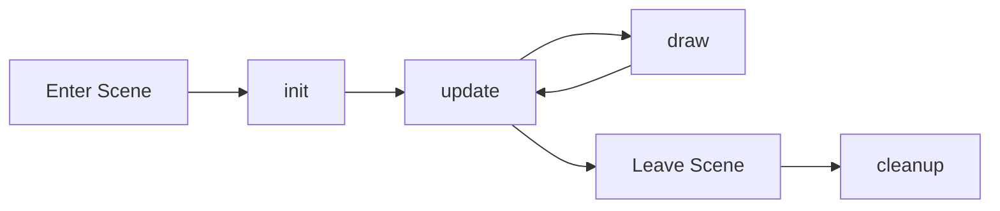

# Scene Management

Organize your game into scenes for better structure and maintainability.

## What are Scenes?

Scenes are different "states" of your game:
- **Menu** - Title screen, main menu
- **Gameplay** - The actual game
- **Game Over** - End screen, results
- **Settings** - Options, controls
- **Pause** - Pause menu

Each scene has its own logic and rendering, keeping your code organized.

## Creating a Scene

Use the `scene()` function to define a scene:

```lootiscript
scene("menu", {
  init: function() {
    // Called once when entering this scene
    console.log("Menu loaded")
  },
  
  update: function() {
    // Called every frame (60 FPS)
    if (input.isKeyPressed("Space")) {
      route.goto("game")
    }
  },
  
  draw: function() {
    // Called every frame after update
    canvas.clear("black")
    canvas.drawText("Press SPACE to start", 300, 300, "24px Arial", "white")
  },
  
  cleanup: function() {
    // Called when leaving this scene (optional)
    console.log("Leaving menu")
  }
})
```

## Scene Lifecycle

When you navigate to a scene, this happens:

1. **Previous scene's `cleanup()`** - Clean up old scene
2. **New scene's `init()`** - Initialize new scene
3. **New scene's `update()` and `draw()`** - Game loop starts



## Navigating Between Scenes

Use the `route` API to navigate:

```lootiscript
// Go to a scene
route.goto("gameplay")

// Get current scene name
let current = route.current()

// Check current scene
if (route.current() === "menu") {
  // We're in the menu
}
```

## Complete Example: Multi-Scene Game

```lootiscript
// Game state (shared across scenes)
let score = 0
let highScore = storage.get("highScore", 0)

// Menu Scene
scene("menu", {
  init: function() {
    // Load high score
    highScore = storage.get("highScore", 0)
  },
  update: function() {
    if (input.isKeyPressed("Space")) {
      route.goto("game")
    }
  },
  draw: function() {
    canvas.clear("#1a1a2e")
    canvas.drawText("MY AWESOME GAME", 250, 200, "bold 36px Arial", "white")
    canvas.drawText("High Score: " + highScore, 300, 260, "20px Arial", "gold")
    canvas.drawText("Press SPACE to start", 280, 350, "18px Arial", "gray")
  }
})

// Game Scene
scene("game", {
  init: function() {
    // Reset game state
    score = 0
    playerX = 400
    playerY = 300
    gameOver = false
  },
  update: function() {
    if (gameOver) {
      if (input.isKeyPressed("Space")) {
        route.goto("gameover")
      }
      return
    }
    
    // Game logic
    if (input.isKeyDown("ArrowRight")) playerX = playerX + 5
    if (input.isKeyDown("ArrowLeft")) playerX = playerX - 5
    
    // Check game over condition
    if (playerX < 0 || playerX > 800) {
      gameOver = true
    }
  },
  draw: function() {
    canvas.clear("black")
    
    if (gameOver) {
      canvas.drawText("Game Over!", 320, 300, "32px Arial", "red")
      canvas.drawText("Press SPACE to continue", 280, 350, "18px Arial", "white")
    } else {
      // Draw game
      canvas.fillRect(playerX, playerY, 32, 32, "cyan")
      canvas.drawText("Score: " + score, 10, 30, "20px Arial", "white")
    }
  }
})

// Game Over Scene
scene("gameover", {
  init: function() {
    // Update high score
    if (score > highScore) {
      highScore = score
      storage.set("highScore", highScore)
    }
  },
  update: function() {
    if (input.isKeyPressed("Space")) {
      route.goto("menu")
    }
  },
  draw: function() {
    canvas.clear("#1a1a2e")
    canvas.drawText("GAME OVER", 300, 200, "bold 36px Arial", "red")
    canvas.drawText("Your Score: " + score, 310, 260, "24px Arial", "white")
    canvas.drawText("High Score: " + highScore, 305, 300, "20px Arial", "gold")
    canvas.drawText("Press SPACE for menu", 280, 380, "18px Arial", "gray")
  }
})

// Start the game at menu
route.goto("menu")
```

## Best Practices

### 1. Initialize in `init()`
```lootiscript
scene("game", {
  init: function() {
    // ✅ Reset game state here
    score = 0
    lives = 3
    level = 1
  }
})
```

### 2. Clean up in `cleanup()`
```lootiscript
scene("game", {
  cleanup: function() {
    // ✅ Stop sounds, clear timers, etc.
    stopBackgroundMusic()
  }
})
```

### 3. Share Data Wisely
```lootiscript
// ✅ Use global variables for shared state
let playerName = "Player"
let totalScore = 0

// ✅ Or use storage for persistence
storage.set("playerProgress", { level: 5, coins: 100 })
```

### 4. Keep Scenes Focused
```lootiscript
// ✅ Good: One scene per game state
scene("menu", { ... })
scene("game", { ... })
scene("pause", { ... })
scene("gameover", { ... })

// ❌ Bad: Trying to do everything in one scene
scene("everything", { ... })
```

## Common Patterns

### Pause Menu
```lootiscript
let paused = false

scene("game", {
  update: function() {
    if (input.isKeyPressed("Escape")) {
      paused = !paused
    }
    
    if (!paused) {
      // Game logic only when not paused
      updatePlayer()
      updateEnemies()
    }
  },
  draw: function() {
    // Always draw game
    drawGame()
    
    // Draw pause overlay if paused
    if (paused) {
      canvas.fillRect(0, 0, 800, 600, "rgba(0,0,0,0.5)")
      canvas.drawText("PAUSED", 350, 300, "32px Arial", "white")
    }
  }
})
```

### Loading Screen
```lootiscript
scene("loading", {
  init: function() {
    // Start loading assets
    loadAssets()
  },
  update: function() {
    if (assetsLoaded) {
      route.goto("menu")
    }
  },
  draw: function() {
    canvas.clear("black")
    canvas.drawText("Loading...", 350, 300, "24px Arial", "white")
  }
})
```

## Next Steps

- See [Route API](/api/framework/route) for navigation details
- Check out [Scene Example](/examples/scenes)
- Learn about [Storage API](/api/core/storage) for saving data between scenes
